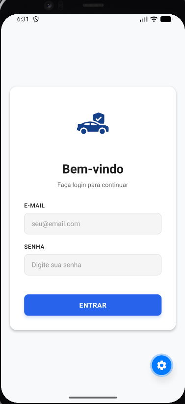
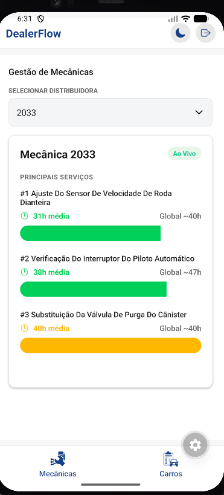
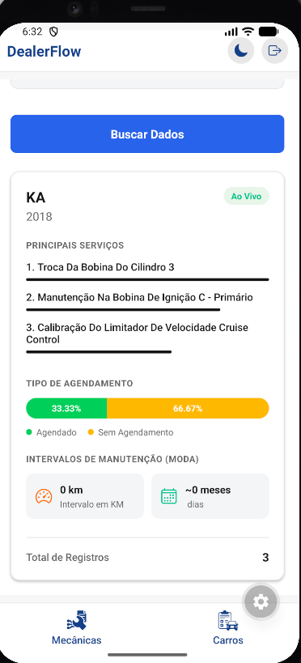

# DEALER FLOW

## VISÃO GERAL

Nosso grupo escolheu o **Desafio 2**, focado em manutenção preditiva e análise de pós-venda.

**Motivos para a escolha deste desafio:**
- Oferece maior liberdade para a arquitetura e construção do projeto.
- Traz a possibilidade de resolver uma dor real da Ford.
- Permite o uso de tecnologias mais alinhadas com as habilidades que desejamos aperfeiçoar.

---

## FUNCIONALIDADES

**Funcionalidades já implementadas no aplicativo mobile (até o momento):**
- **Autenticação:** Sistema de login e gerenciamento de usuários.
- **Página de Mecânicas:** Apresenta um dashboard com os principais serviços realizados e o tempo médio de conclusão, com opções de filtros por mecânica.
- **Página de Carros:** Permite consultar todos os modelos de veículos da base de dados, exibindo seus principais serviços, intervalos de manutenção, entre outras informações relevantes.

---

## INTEGRANTES

| Nome | RM | 
|------------------------------|-----------| 
| Gabriel Luni Nakashima       | RM 558096 |
| Gustavo Henrique de Oliveira | RM 556712 |
| Milena Garcia Sousa Costa    | RM 555111 |
| Renan Simões Gonçalves       | RM 555584 | 
| Vinicius Vilas Boas          | RM 557843 |

---

## COMO RODAR O PROJETO (Passo a Passo)

1. Clone o repositório em sua máquina:
   ```bash
   git clone https://github.com/ViniciusVilasB/fiap-mdi-sprint-dealer-flow-app.git
   ```
2. Acesse o diretório do projeto:
   ```bash
   cd fiap-mdi-sprint-dealer-flow-app
   ```
3. Instale as dependências:
   ```bash
   npm install
   npx expo install expo-secure-store
   ```
4. Inicie o servidor de desenvolvimento:
   ```bash
   npx expo start
   ```
5. Utilize as credenciais *mockadas* abaixo para realizar o login e testar o app:
   - **E-mail:** lena@gmail.com
   - **Senha:** 12345

---

## DEMONSTRAÇÃO VISUAL

### 1. Capturas de Tela

- **Login**:
  
   

- **Dashboard de Mecânicas**:
  
   

- **Dashboard de Carros**:
  
   

### 2. Vídeo do Fluxo Principal

- **Link:** [Assistir no YouTube](https://youtube.com/shorts/WgyVB5XgkPM?feature=share)

---

## DECISÕES TÉCNICAS

### Stack Escolhida e Justificativas

* **React Native:** Adotado como o framework base do projeto por ser um requisito obrigatório para o desenvolvimento.
* **Estratégia de Armazenamento Híbrido:**
  * **Async Storage:** Utilizado para o armazenamento de dados durante a fase de testes na plataforma Web.
  * **Expo Secure Store:** Aplicado nos dispositivos *mobile* para garantir um armazenamento seguro, isolado e totalmente criptografado.
* **Axios:** Escolhido como cliente HTTP para facilitar, otimizar e aprimorar a comunicação e o consumo da API pela interface do aplicativo.

### Estruturação do Projeto

* **Divisão de Responsabilidades (Client-Server):** O aplicativo atua essencialmente como a camada de apresentação e estruturação visual. Ele consome e exibe análises de dados, enquanto a lógica de negócios e o processamento pesado ficam centralizados no servidor (API).
* **Segurança de Ponta a Ponta:** A arquitetura foi desenhada para garantir que nenhum dado sensível trafegue ou seja armazenado de forma vulnerável. A comunicação de rede é blindada e os dados retidos no dispositivo são protegidos localmente.

### Integrações e Mecanismos

* **Comunicação Exclusiva via API:** Toda integração do aplicativo com fontes de dados ou persistência é feita **exclusivamente** através da API proprietária, eliminando conexões diretas do app com o banco de dados.
* **API Própria (In-House):** Totalmente desenvolvida pela equipe, a API funciona como intermediária do banco de dados e é responsável por:
  * Gerenciar a autenticação de usuários.
  * Controlar permissões e níveis de acesso.
  * Processar e fornecer os dados analíticos cruciais que alimentam os dashboards do app.

### Decisões Relevantes de Arquitetura

* **Descentralização da Lógica:** Optamos por manter o aplicativo leve. A inteligência robusta e o processamento analítico ocorrem na API, deixando o app responsável apenas por receber e renderizar as informações de forma interativa.
* **Protocolo de Comunicação Seguro:** Todo tráfego de dados entre o aplicativo e os serviços externos é realizado obrigatoriamente via **HTTPS**.
* **Criptografia Local (At-Rest):** Como medida rigorosa de segurança, todos os dados que precisam ser salvos localmente nos dispositivos móveis são criptografados na origem antes do armazenamento.

---

## PRÓXIMOS PASSOS

Esta é a primeira etapa da nossa solução. Inicialmente, dedicamos a maior parte do nosso tempo ao planejamento e consolidação das ideias antes de partirmos para a construção. Para a evolução do projeto, pretendemos adicionar:

1. **Mais dashboards e gráficos:** Neste primeiro momento, incluímos um dashboard básico para cada seção. A ideia agora é adicionar mais componentes visuais e opções de filtros avançados para enriquecer a exploração de dados.
2. **Integração com IA Preditiva:** Temos um modelo de inteligência artificial em desenvolvimento focado em predições. O objetivo é integrar os resultados gerados por ele diretamente no aplicativo, permitindo o monitoramento proativo de falhas e manutenções.
3. **Integração com IA Generativa:** Nosso aplicativo já apresenta os dados tratados de forma visual, mas queremos facilitar a extração de *insights*. Para auxiliar nossos clientes nas tomadas de decisão, pretendemos integrar uma IA generativa capaz de ler, interpretar os dados em tela e gerar relatórios ou sugestões automatizadas de melhorias.
