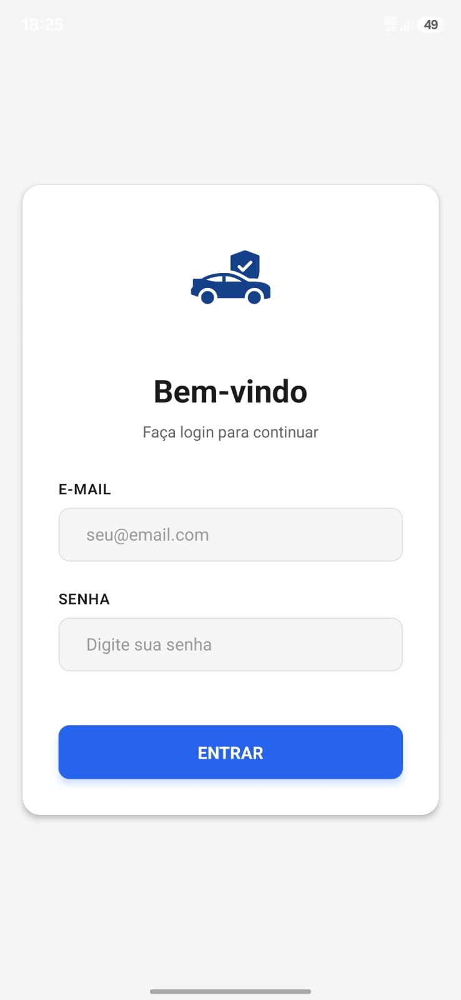
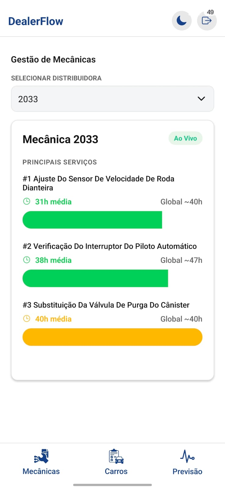
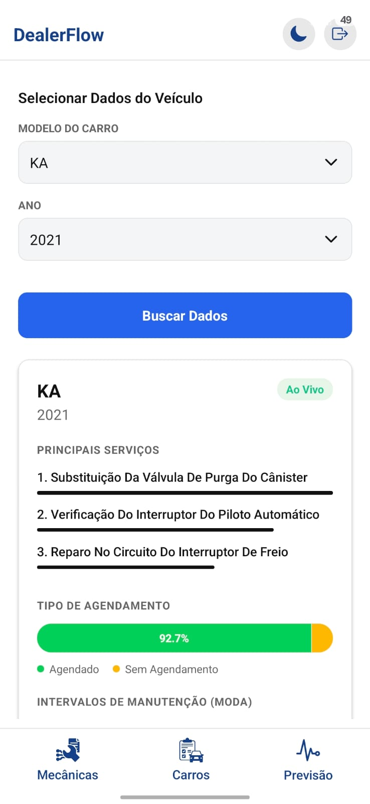
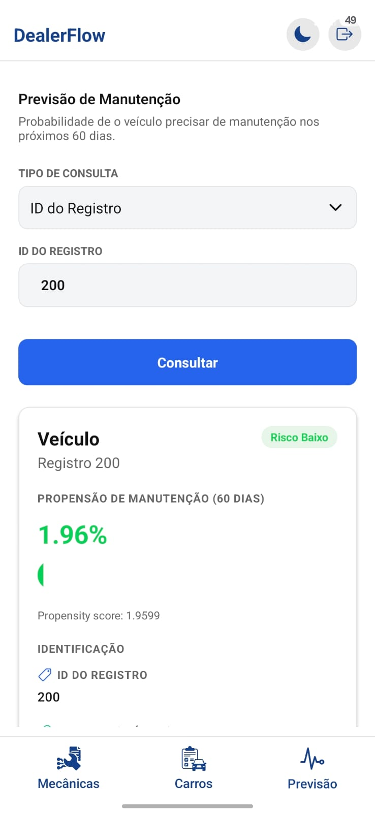

# DEALER FLOW

## VISÃO GERAL

Nosso grupo escolheu o **Desafio 2**, focado em manutenção preditiva e análise de pós-venda.

**Motivos para a escolha deste desafio:**
- Oferece maior liberdade para a arquitetura e construção do projeto.
- Traz a possibilidade de resolver uma dor real da Ford.
- Permite o uso de tecnologias mais alinhadas com as habilidades que desejamos aperfeiçoar.

---

## FUNCIONALIDADES

**Funcionalidades já implementadas no aplicativo mobile (até o momento):**
- **Autenticação:** Sistema de login e gerenciamento de usuários.
- **Página de Mecânicas:** Apresenta um dashboard com os principais serviços realizados e o tempo médio de conclusão, com opções de filtros por mecânica.
- **Página de Carros:** Permite consultar todos os modelos de veículos da base de dados, exibindo seus principais serviços, intervalos de manutenção, entre outras informações relevantes.
- **Página de Previsão:** Permite consultar a probabilidade de um veículo precisar de manutenção nos próximos 60 dias. O `propensity_score` retornado pela API **é a porcentagem** (base atual: 0,59% a 54,78%, mediana 4,6%), exibida com 2 casas decimais e classificada em risco Baixo (<15%), Médio (15%–30%) ou Alto (>30%). A busca aceita três chaves, cada uma em uma base diferente: **ID do registro** (PK da tabela de dados), **ID de manutenção** (PK da tabela de manutenção) e **VIN Hash** (hash que identifica o veículo).

> **Pendência com o backend:** `GET /auth/me` responde `500` para tokens válidos. O app trata isso e segue funcionando com a sessão em cache.

---

## INTEGRANTES

| Nome | RM | 
|------------------------------|-----------| 
| Gabriel Luni Nakashima       | RM 558096 |
| Gustavo Henrique de Oliveira | RM 556712 |
| Milena Garcia Sousa Costa    | RM 555111 |
| Renan Simões Gonçalves       | RM 555584 | 
| Vinicius Vilas Boas          | RM 557843 |

---

## COMO RODAR O PROJETO

Existem duas formas de testar o app: rodando localmente via Expo (para desenvolvimento) ou instalando o APK diretamente em um dispositivo Android (para teste rápido, sem precisar configurar o ambiente).
 
### Opção 1 — Rodar localmente (modo desenvolvimento)

1. Clone o repositório em sua máquina:
   ```bash
   git clone https://github.com/ViniciusVilasB/fiap-mdi-sprint-dealer-flow-app.git
   ```
2. Acesse o diretório do projeto:
   ```bash
   cd fiap-mdi-sprint-dealer-flow-app
   ```
3. Instale as dependências:
   ```bash
   npm install
   ```
4. Inicie o servidor de desenvolvimento:
   ```bash
   npx expo start
   ```

### Opção 2 — Testar via APK (Android)
 
Para quem quer apenas testar o app em um celular ou emulador Android, sem precisar configurar o ambiente de desenvolvimento:
 
1. Baixe o APK mais recente: **https://expo.dev/accounts/boas.vini/projects/app-dealer-flow/builds/e783837e-59a7-446d-ac97-5f0c44beaad0**
2. Transfira o arquivo `.apk` para o dispositivo Android (ou abra o link diretamente no navegador do celular).
3. Ao abrir o arquivo, caso o Android bloqueie a instalação, ative a permissão **"Instalar apps de fontes desconhecidas"** para o navegador/gerenciador de arquivos usado.
4. Após instalado, abra o app **DealerFlow** e faça login com as credenciais mockadas acima.

### Utilize as credenciais *mockadas* abaixo para realizar o login e testar o app:
   - **E-mail:** professor.sensacional@gmail.com
   - **Senha:** SenhaSegura!

---

## DEMONSTRAÇÃO VISUAL

### 1. Capturas de Tela

<p float="left">
  
  
  
  
</p>

### 2. Vídeo do Fluxo Principal

- **Link:** [Assistir no YouTube](https://youtube.com/shorts/BrzlIx74MOY?is=fc2cu7yqh8xtzBpK)

---

## DECISÕES TÉCNICAS

### Stack Escolhida e Justificativas

* **React Native:** Adotado como o framework base do projeto por ser um requisito obrigatório para o desenvolvimento.
* **Estratégia de Armazenamento Híbrido:**
  * **Async Storage:** Utilizado para o armazenamento de dados durante a fase de testes na plataforma Web.
  * **Expo Secure Store:** Aplicado nos dispositivos *mobile* para garantir um armazenamento seguro, isolado e totalmente criptografado.
* **Axios:** Escolhido como cliente HTTP para facilitar, otimizar e aprimorar a comunicação e o consumo da API pela interface do aplicativo.
* **Expo EAS Build:** Utilizado para gerar builds nativos (APK/AAB) na nuvem, sem depender de configuração local do Android SDK.

### Estruturação do Projeto

* **Divisão de Responsabilidades (Client-Server):** O aplicativo atua essencialmente como a camada de apresentação e estruturação visual. Ele consome e exibe análises de dados, enquanto a lógica de negócios e o processamento pesado ficam centralizados no servidor (API).
* **Segurança de Ponta a Ponta:** A arquitetura foi desenhada para garantir que nenhum dado sensível trafegue ou seja armazenado de forma vulnerável. A comunicação de rede é blindada e os dados retidos no dispositivo são protegidos localmente.

### Integrações e Mecanismos

* **Comunicação Exclusiva via API:** Toda integração do aplicativo com fontes de dados ou persistência é feita **exclusivamente** através da API proprietária, eliminando conexões diretas do app com o banco de dados.
* **API Própria (In-House):** Totalmente desenvolvida pela equipe, a API funciona como intermediária do banco de dados e é responsável por:
  * Gerenciar a autenticação de usuários.
  * Controlar permissões e níveis de acesso.
  * Processar e fornecer os dados analíticos cruciais que alimentam os dashboards do app.

### Decisões Relevantes de Arquitetura

* **Descentralização da Lógica:** Optamos por manter o aplicativo leve. A inteligência robusta e o processamento analítico ocorrem na API, deixando o app responsável apenas por receber e renderizar as informações de forma interativa.
* **Protocolo de Comunicação Seguro:** Todo tráfego de dados entre o aplicativo e os serviços externos é realizado obrigatoriamente via **HTTPS**.
* **Criptografia Local (At-Rest):** Como medida rigorosa de segurança, todos os dados que precisam ser salvos localmente nos dispositivos móveis são criptografados na origem antes do armazenamento.
